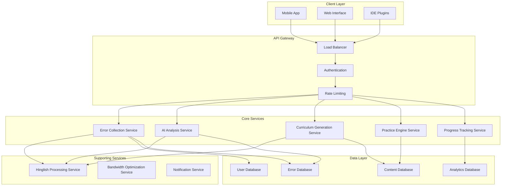

# Design Document: From Error to Curriculum

## Overview

The "From Error to Curriculum" system is an AI-powered educational platform that transforms student mistakes into personalized learning opportunities. The system employs a microservices architecture optimized for the Indian educational context, supporting low-bandwidth environments and Hinglish language processing.

The core innovation lies in the error-to-learning pipeline: errors are captured from multiple sources (IDEs, exam platforms, coding environments), analyzed using AI to identify root causes and skill gaps, and transformed into personalized curricula that address specific learning needs. This approach moves beyond traditional reactive error fixing to proactive skill development.

## Architecture

The system follows a distributed microservices architecture with the following key design principles:

### High-Level Architecture



### Service Communication Patterns

- **Synchronous Communication**: REST APIs for real-time user interactions
- **Asynchronous Communication**: Message queues for error processing and curriculum generation
- **Event-Driven Architecture**: Event streaming for progress tracking and analytics
- **Caching Strategy**: Multi-level caching for content delivery and bandwidth optimization

## Components and Interfaces

### Error Collection Service

**Purpose**: Captures and standardizes errors from multiple sources

**Key Components**:
- **Error Ingestion API**: RESTful endpoints for receiving errors from various sources
- **Source Adapters**: Pluggable adapters for different error sources (IDE, exam platforms, coding environments)
- **Error Standardizer**: Normalizes error formats into a common schema
- **Privacy Filter**: Removes sensitive information while preserving learning context

**Interfaces**:
```typescript
interface ErrorCollectionAPI {
  captureCompilerError(error: CompilerError, context: CodeContext): Promise<ErrorId>
  captureExamError(error: ExamError, context: ExamContext): Promise<ErrorId>
  captureLogicError(error: LogicError, context: ProblemContext): Promise<ErrorId>
}

interface StandardizedError {
  id: string
  userId: string
  source: ErrorSource
  type: ErrorType
  content: string
  context: ErrorContext
  timestamp: Date
  metadata: Record<string, any>
}
```

### AI Analysis Service

**Purpose**: Processes errors to identify root causes and skill gaps using machine learning

**Key Components**:
- **Error Classifier**: Categorizes errors by subject, difficulty, and type using NLP models
- **Root Cause Analyzer**: Identifies underlying knowledge gaps using pattern recognition
- **Skill Gap Mapper**: Maps errors to specific learning objectives and competencies
- **Pattern Detector**: Identifies recurring mistake patterns across user history

**Machine Learning Pipeline**:
1. **Preprocessing**: Text cleaning, tokenization, and feature extraction
2. **Classification**: Multi-label classification for error categorization
3. **Similarity Analysis**: Semantic similarity matching for pattern detection
4. **Knowledge Graph Integration**: Mapping errors to educational ontologies

**Interfaces**:
```typescript
interface AIAnalysisAPI {
  analyzeError(errorId: string): Promise<ErrorAnalysis>
  identifySkillGaps(userId: string, errors: ErrorId[]): Promise<SkillGap[]>
  detectPatterns(userId: string, timeWindow: TimeRange): Promise<ErrorPattern[]>
}

interface ErrorAnalysis {
  errorId: string
  classification: ErrorClassification
  rootCauses: RootCause[]
  skillGaps: SkillGap[]
  confidence: number
  recommendations: string[]
}
```

### Curriculum Generation Service

**Purpose**: Creates personalized learning paths based on identified skill gaps

**Key Components**:
- **Learning Path Generator**: Creates sequential learning activities addressing skill gaps
- **Content Recommender**: Selects appropriate learning materials from content database
- **Difficulty Adjuster**: Adapts content difficulty based on user proficiency
- **Cultural Contextualizer**: Ensures content relevance for Indian educational context

**Curriculum Generation Algorithm**:
1. **Gap Prioritization**: Rank skill gaps by impact and frequency
2. **Prerequisite Analysis**: Identify foundational concepts needed
3. **Learning Sequence**: Create optimal learning order using dependency graphs
4. **Content Selection**: Match learning objectives to available content
5. **Personalization**: Adapt to user preferences and learning style

**Interfaces**:
```typescript
interface CurriculumAPI {
  generateCurriculum(userId: string, skillGaps: SkillGap[]): Promise<LearningPath>
  updateCurriculum(userId: string, progress: LearningProgress): Promise<LearningPath>
  getCurriculumStatus(userId: string): Promise<CurriculumStatus>
}

interface LearningPath {
  id: string
  userId: string
  modules: LearningModule[]
  estimatedDuration: Duration
  difficulty: DifficultyLevel
  prerequisites: string[]
}
```

### Practice Engine Service

**Purpose**: Provides targeted practice exercises and assessments

**Key Components**:
- **Exercise Recommender**: Suggests practice problems based on skill gaps
- **Difficulty Adapter**: Adjusts problem difficulty based on performance
- **Performance Analyzer**: Evaluates user responses and provides feedback
- **Exam Simulator**: Creates exam-like practice sessions

**Interfaces**:
```typescript
interface PracticeEngineAPI {
  recommendExercises(userId: string, skillGaps: SkillGap[]): Promise<Exercise[]>
  submitSolution(exerciseId: string, solution: Solution): Promise<Feedback>
  generateExamSession(userId: string, examType: ExamType): Promise<ExamSession>
}

interface Exercise {
  id: string
  type: ExerciseType
  difficulty: DifficultyLevel
  content: string
  expectedSolution: Solution
  hints: string[]
  timeLimit?: Duration
}
```

### Hinglish Processing Service

**Purpose**: Handles mixed Hindi-English language processing and content generation

**Key Components**:
- **Language Detector**: Identifies language mix in user input
- **Script Converter**: Converts between Devanagari and Roman scripts
- **Translation Engine**: Provides contextual translations and explanations
- **Cultural Adapter**: Adapts content for Indian cultural context

**Language Processing Pipeline**:
1. **Language Detection**: Identify Hindi/English segments in text
2. **Script Normalization**: Convert to consistent script format
3. **Semantic Analysis**: Extract meaning preserving cultural context
4. **Content Generation**: Produce culturally appropriate explanations

**Interfaces**:
```typescript
interface HinglishAPI {
  processText(text: string): Promise<ProcessedText>
  generateExplanation(concept: string, language: LanguagePreference): Promise<string>
  translateContent(content: string, targetLanguage: Language): Promise<string>
}

interface ProcessedText {
  originalText: string
  detectedLanguages: Language[]
  normalizedText: string
  culturalContext: CulturalMarker[]
}
```

## Data Models

### User Profile Model

```typescript
interface UserProfile {
  id: string
  personalInfo: {
    name: string
    email: string
    phoneNumber?: string
    location: Location
  }
  educationalInfo: {
    currentLevel: EducationLevel
    subjects: Subject[]
    targetExams: Exam[]
    institutions: Institution[]
  }
  preferences: {
    language: LanguagePreference
    learningStyle: LearningStyle
    difficultyPreference: DifficultyLevel
    studySchedule: Schedule
  }
  skillProfile: {
    strengths: SkillArea[]
    weaknesses: SkillArea[]
    masteryLevels: Map<Subject, MasteryLevel>
    learningGoals: Goal[]
  }
  activityHistory: {
    errors: ErrorRecord[]
    completedLessons: LessonRecord[]
    practiceHistory: PracticeRecord[]
    progressMilestones: Milestone[]
  }
}
```

### Error Data Model

```typescript
interface ErrorRecord {
  id: string
  userId: string
  source: ErrorSource
  captureTime: Date
  errorData: {
    type: ErrorType
    category: ErrorCategory
    severity: ErrorSeverity
    content: string
    context: ErrorContext
  }
  analysis: {
    rootCauses: RootCause[]
    skillGaps: SkillGap[]
    patterns: ErrorPattern[]
    confidence: number
  }
  resolution: {
    status: ResolutionStatus
    learningActivities: LearningActivity[]
    improvementMetrics: ImprovementMetric[]
  }
}
```

### Learning Content Model

```typescript
interface LearningContent {
  id: string
  metadata: {
    title: string
    description: string
    subject: Subject
    topics: Topic[]
    difficulty: DifficultyLevel
    estimatedDuration: Duration
  }
  content: {
    type: ContentType
    format: ContentFormat
    language: Language
    data: ContentData
  }
  pedagogical: {
    learningObjectives: LearningObjective[]
    prerequisites: Prerequisite[]
    assessmentCriteria: AssessmentCriterion[]
    culturalContext: CulturalContext
  }
  analytics: {
    usage: UsageStatistics
    effectiveness: EffectivenessMetrics
    feedback: UserFeedback[]
  }
}
```

### Progress Tracking Model

```typescript
interface LearningProgress {
  userId: string
  currentPath: LearningPath
  completedModules: CompletedModule[]
  activeModule: ActiveModule
  performance: {
    overallScore: number
    subjectScores: Map<Subject, number>
    improvementRate: number
    consistencyMetrics: ConsistencyMetric[]
  }
  milestones: {
    achieved: Milestone[]
    upcoming: Milestone[]
    streaks: LearningStreak[]
  }
  analytics: {
    timeSpent: Map<Subject, Duration>
    errorReduction: ErrorReductionMetric[]
    skillImprovement: SkillImprovementMetric[]
  }
}
```

Now I need to use the prework tool to analyze the acceptance criteria before writing the Correctness Properties section.
## Correctness Properties

*A property is a characteristic or behavior that should hold true across all valid executions of a system—essentially, a formal statement about what the system should do. Properties serve as the bridge between human-readable specifications and machine-verifiable correctness guarantees.*

### Property 1: Comprehensive Error Capture
*For any* error occurring in supported environments (compiler, exam, logic), the Error_Collector should capture all essential information including error content, context, and metadata with proper privacy filtering
**Validates: Requirements 1.1, 1.2, 1.3, 1.4**

### Property 2: Error Classification Completeness
*For any* collected error, the AI_Analyzer should assign appropriate classifications for subject area, difficulty level, and error type with measurable confidence levels
**Validates: Requirements 2.1**

### Property 3: Root Cause Identification
*For any* analyzed error, the AI_Analyzer should identify at least one root cause and map it to specific learning objectives and skill areas
**Validates: Requirements 2.2, 2.3**

### Property 4: Multi-Domain Analysis Support
*For any* error from supported programming languages or academic subjects, the AI_Analyzer should provide appropriate analysis regardless of the domain
**Validates: Requirements 2.4**

### Property 5: Pattern Detection Across History
*For any* user with multiple errors, the AI_Analyzer should identify recurring patterns when they exist in the error history
**Validates: Requirements 2.5**

### Property 6: Profile Creation and Maintenance
*For any* new user registration or learning activity completion, the system should properly create or update the Learner_Profile with accurate information and maintain complete history
**Validates: Requirements 3.1, 3.2, 3.3, 3.4**

### Property 7: User Insight Generation
*For any* user profile with sufficient data, the system should generate meaningful insights about learning patterns and progress when requested
**Validates: Requirements 3.5**

### Property 8: Personalized Curriculum Generation
*For any* identified skill gaps, the Curriculum_Generator should create learning sequences that address those gaps while considering user characteristics and providing diverse learning modalities
**Validates: Requirements 4.1, 4.2, 4.3, 4.4**

### Property 9: Cultural Context Appropriateness
*For any* generated content (curriculum, explanations, feedback), the system should include appropriate cultural context, examples, and strategies relevant to Indian educational settings
**Validates: Requirements 4.5, 7.5, 9.5**

### Property 10: Targeted Practice Recommendations
*For any* learning path with identified skill gaps, the Practice_Engine should recommend exercises that target those gaps with appropriate difficulty and exam relevance
**Validates: Requirements 5.1, 5.2, 5.5**

### Property 11: Adaptive Practice Engine
*For any* completed practice exercise, the Practice_Engine should analyze performance and adjust future recommendations to improve learning effectiveness
**Validates: Requirements 5.3**

### Property 12: Multi-Modal Exercise Support
*For any* practice recommendation request, the Practice_Engine should support both coding exercises and academic problem sets as appropriate for the skill gaps
**Validates: Requirements 5.4**

### Property 13: Comprehensive Progress Tracking
*For any* user engagement with learning materials, the Progress_Tracker should record all relevant metrics including completion rates, time spent, and performance data
**Validates: Requirements 6.1**

### Property 14: Learning Improvement Detection
*For any* user with learning history, the Progress_Tracker should identify improvements in specific skill areas and overall learning trajectory over time
**Validates: Requirements 6.2**

### Property 15: Progress Visualization and Milestones
*For any* user progress data, the system should provide visual representations and track achievement milestones appropriately
**Validates: Requirements 6.3**

### Property 16: Skill Gap Resolution Detection
*For any* previously identified skill gap, the Progress_Tracker should detect when the gap has been successfully addressed through learning activities
**Validates: Requirements 6.4**

### Property 17: Learning Maintenance Recommendations
*For any* successfully learned concept, the system should provide appropriate recommendations for maintaining and building upon that knowledge
**Validates: Requirements 6.5**

### Property 18: Hinglish Text Processing
*For any* mixed Hindi-English text input, the Hinglish_Processor should correctly interpret the content and understand technical contexts including code comments
**Validates: Requirements 7.1, 7.3**

### Property 19: Language-Appropriate Content Generation
*For any* content generation request, the system should produce explanations and feedback in Hinglish that matches user language preferences
**Validates: Requirements 7.2**

### Property 20: Multi-Script Support
*For any* Hindi content, the system should properly process and display both Devanagari and Roman script formats
**Validates: Requirements 7.4**

### Property 21: Bandwidth-Optimized Content Delivery
*For any* content request under bandwidth constraints, the Bandwidth_Optimizer should prioritize essential content and provide progressive loading based on available bandwidth
**Validates: Requirements 8.1, 8.4**

### Property 22: Comprehensive Offline Functionality
*For any* offline usage scenario, the system should provide access to downloaded content, store offline activities, and efficiently sync when connectivity is restored
**Validates: Requirements 8.2, 8.5, 10.4**

### Property 23: Efficient Data Synchronization
*For any* data sync operation, the Bandwidth_Optimizer should compress and batch transfers to minimize bandwidth usage
**Validates: Requirements 8.3**

### Property 24: Exam-Focused Content Quality
*For any* generated explanation or practice material, the system should provide concise, exam-focused content that highlights key concepts and matches target exam patterns
**Validates: Requirements 9.1, 9.2, 9.3**

### Property 25: Exam Condition Simulation
*For any* practice session request, the system should provide time-bound sessions that accurately simulate target exam conditions
**Validates: Requirements 9.4**

### Property 26: Responsive Mobile Design
*For any* mobile device access, the interface should provide responsive design optimized for the specific screen size while ensuring readability and usability
**Validates: Requirements 10.1, 10.3**

### Property 27: Intuitive Touch Interface
*For any* touch interaction on mobile devices, the system should support intuitive gestures for navigation and content interaction
**Validates: Requirements 10.2**

### Property 28: Mobile Device Integration
*For any* mobile device capability (camera, voice input), the system should properly integrate these features for error capture and Hinglish query processing
**Validates: Requirements 10.5**

## Error Handling

The system implements comprehensive error handling across all components:

### Error Collection Service
- **Malformed Error Data**: Validate and sanitize all incoming error data, reject invalid formats with descriptive error messages
- **Source Integration Failures**: Implement retry mechanisms with exponential backoff for temporary integration failures
- **Privacy Violations**: Automatically detect and filter sensitive information, log privacy violations for audit

### AI Analysis Service  
- **Analysis Failures**: Provide fallback classification when AI analysis fails, maintain service availability
- **Low Confidence Results**: Flag low-confidence analyses for human review, provide uncertainty indicators
- **Model Unavailability**: Implement graceful degradation with rule-based classification when ML models are unavailable

### Curriculum Generation Service
- **Insufficient Data**: Generate basic curricula when user data is limited, request additional information gracefully
- **Content Unavailability**: Provide alternative content recommendations when preferred materials are unavailable
- **Generation Timeouts**: Implement asynchronous generation with progress indicators for complex curricula

### Hinglish Processing Service
- **Language Detection Failures**: Default to user's preferred language when detection fails
- **Translation Errors**: Provide original text with error indicators when translation fails
- **Script Conversion Issues**: Maintain original script when conversion fails, log conversion errors

### Bandwidth Optimization Service
- **Network Failures**: Queue operations for retry when network is unavailable
- **Compression Failures**: Fall back to uncompressed data when compression fails
- **Sync Conflicts**: Implement conflict resolution strategies for offline-online data synchronization

## Testing Strategy

The system employs a comprehensive dual testing approach combining unit tests for specific scenarios and property-based tests for universal correctness validation.

### Property-Based Testing Configuration

**Testing Framework**: The system uses Hypothesis (Python) for property-based testing with the following configuration:
- **Minimum Iterations**: 100 iterations per property test to ensure comprehensive input coverage
- **Test Tagging**: Each property test includes a comment tag referencing the design document property
- **Tag Format**: `# Feature: from-error-to-curriculum, Property {number}: {property_text}`

### Unit Testing Strategy

Unit tests focus on:
- **Specific Examples**: Concrete test cases demonstrating correct behavior for known inputs
- **Edge Cases**: Boundary conditions, empty inputs, maximum limits, and unusual but valid scenarios  
- **Error Conditions**: Invalid inputs, network failures, service unavailability, and malformed data
- **Integration Points**: Service-to-service communication, database interactions, and external API calls

### Property Testing Strategy

Property tests validate:
- **Universal Properties**: Behaviors that must hold across all valid inputs and system states
- **Invariants**: System characteristics that remain constant despite operations (e.g., data integrity, user privacy)
- **Round-Trip Properties**: Operations that should preserve information (e.g., error serialization/deserialization)
- **Metamorphic Properties**: Relationships between different inputs and outputs (e.g., curriculum difficulty progression)

### Testing Coverage Requirements

- **Error Collection**: Property tests for comprehensive capture, unit tests for specific error formats
- **AI Analysis**: Property tests for classification consistency, unit tests for specific error types
- **Curriculum Generation**: Property tests for personalization logic, unit tests for content selection
- **Hinglish Processing**: Property tests for language detection, unit tests for specific text patterns
- **Mobile Interface**: Property tests for responsiveness, unit tests for specific device interactions
- **Offline Functionality**: Property tests for sync consistency, unit tests for specific offline scenarios

### Performance and Load Testing

- **Concurrent User Testing**: Validate system behavior under multiple simultaneous users
- **Bandwidth Simulation**: Test system performance under various network conditions
- **Mobile Device Testing**: Validate performance across different mobile hardware configurations
- **Large Dataset Testing**: Ensure system scalability with extensive user data and error histories

The testing strategy ensures both correctness (through property-based testing) and reliability (through comprehensive unit testing) while maintaining focus on the Indian educational context and mobile-first user experience.